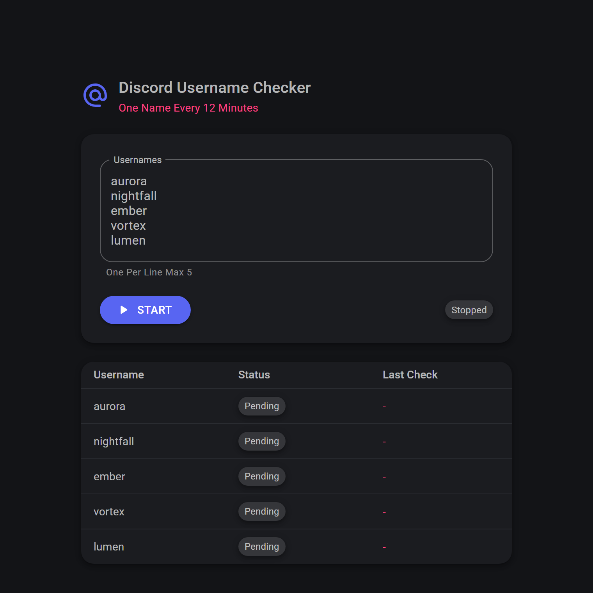
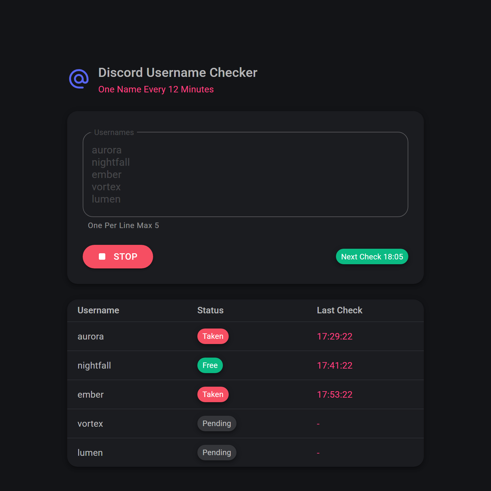

# Discord Username Checker

Watch Whether The Discord Usernames You Want Are Free, Around The Clock

## Features
- Paste Up To 5 Usernames, One Per Line, Duplicates Removed Automatically
- Checks One Name Every 12 Minutes In Rotation, So 5 Names Are Each Rechecked Hourly
- Free, Taken, Error And Pending Status With Last Check Time
- Alert As Soon As A Name Becomes Free
- Waits Out Discord's Rate Limit And Retries The Same Name
- Keeps Running With No Browser Open
- Usernames, Results And Run State Survive Restarts
- Times Shown In Your Browser's Time Zone

## Quick Start
1. Enter Usernames
2. Press Start
3. Wait For A Name To Turn Free

## ⚠️ Important
- Discord Rate Limits This Hard, Which Is Why Checks Are 12 Minutes Apart
- Names Containing "Discord" Are Rejected By Discord And Show As Error
- State Is Shared, Everyone Opening The App Sees And Controls The Same List
- No Token Or Login Needed, It Only Checks Availability And Never Claims Names

## Technical Details
- Blazor Server App Built With C# On .NET 10
- Dark Interface Through MudBlazor
- Background Service Runs The Rotation, SQLite Stores Results And State

## Run Locally
Run `dotnet run` And Open http://localhost:5148
